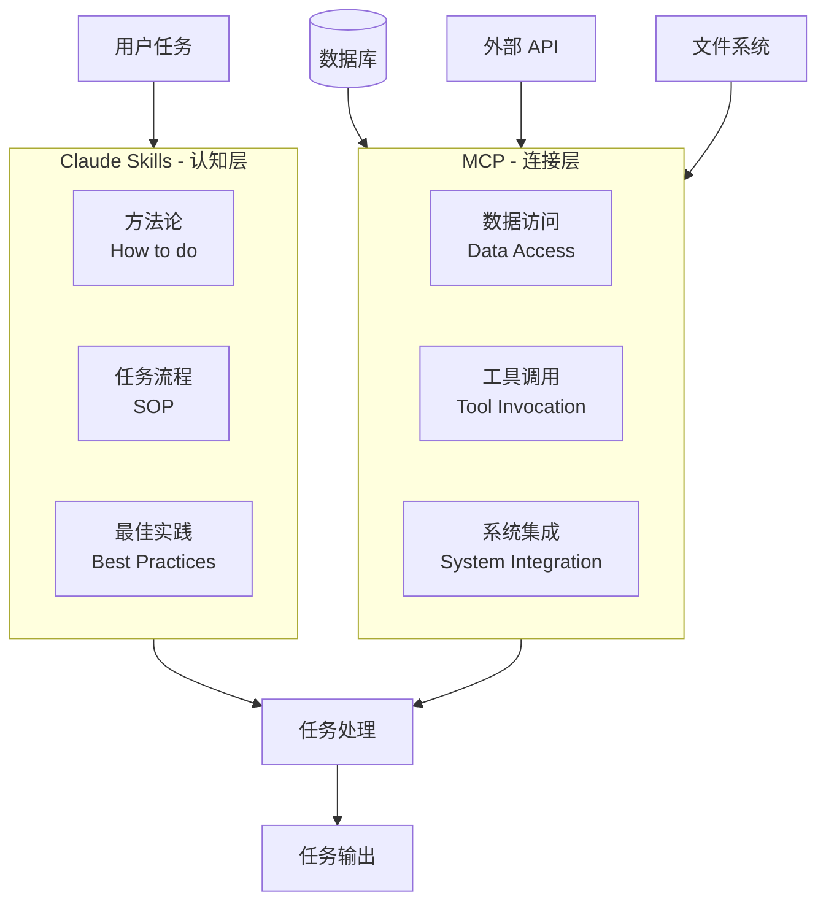
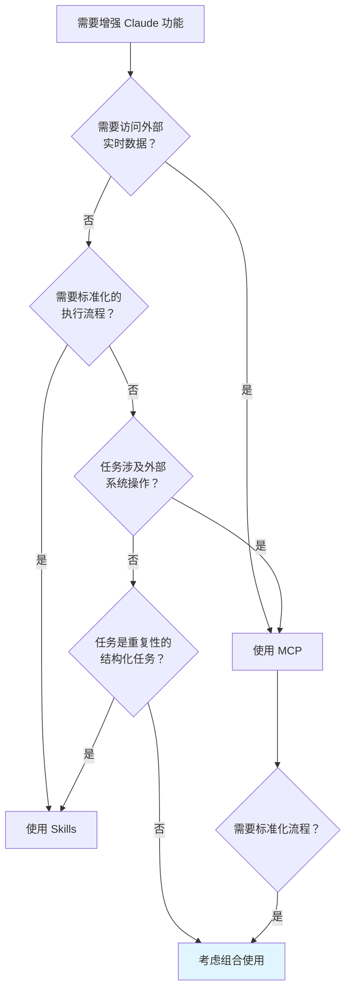
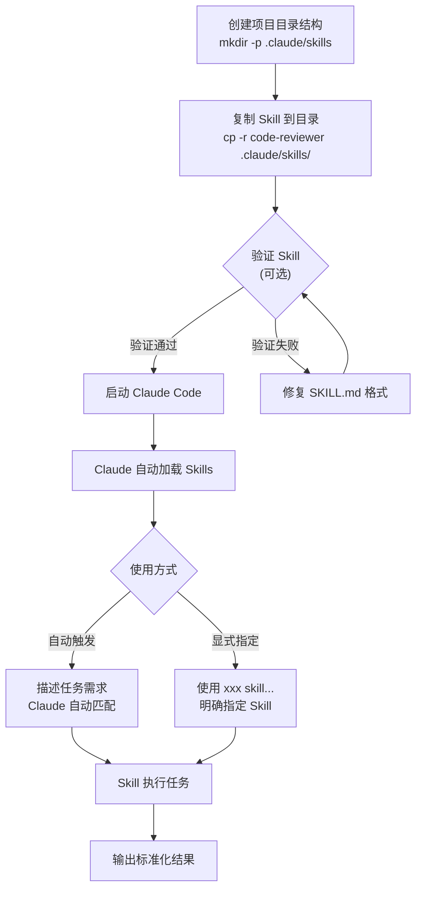

# Claude Skills 核心原理深度解析

> 本文基于 Anthropic 官方 GitHub 仓库 (https://github.com/anthropics/skills) 进行深度调研，全面解析 Claude Skills 的技术原理、与 MCP 的对比分析，以及实战项目案例。

---

## 目录

1. [Claude Skills 的产生背景与问题解决](#一claude-skills-的产生背景与问题解决)
2. [Claude Skills vs MCP 对比分析](#二claude-skills-vs-mcp-对比分析)
3. [实战项目案例：代码审查助手 Skill](#三实战项目案例代码审查助手-skill)
4. [总结与展望](#四总结与展望)

---

## 一、Claude Skills 的产生背景与问题解决

### 1.1 从"会说"到"会做"的演进需求

大型语言模型（LLM）经历了从**对话式 AI** 到**智能体（Agent）**的重大演进。在这个过程中，核心挑战从"让模型理解和生成文本"转变为"让模型知道**怎么做**以及**如何获取所需资源**"。

```
传统 LLM 应用模式：
用户 → 提示词 → 模型 → 文本输出

智能体（Agent）模式：
用户 → 任务描述 → 模型 → [理解任务 → 规划步骤 → 执行操作 → 获取资源] → 任务完成
```

这种演进带来了新的技术挑战：如何让模型高效、准确、一致地执行特定任务？

### 1.2 传统方法的三大痛点

在 Claude Skills 出现之前，开发者主要依赖以下方法来增强模型的任务执行能力：

#### 痛点一：上下文资源浪费

传统的工具集成方式需要在上下文中预加载所有工具定义，即使这些工具在当前任务中并未使用。

```python
# 传统方式：预加载所有工具定义
tools = [
    {"name": "search_web", "description": "搜索网页", ...},
    {"name": "read_file", "description": "读取文件", ...},
    {"name": "write_code", "description": "编写代码", ...},
    {"name": "analyze_data", "description": "分析数据", ...},
    # ... 可能有数十个工具定义
]

# 问题：即使只需要 search_web，其他所有工具定义也会占用宝贵的上下文 token
```

#### 痛点二：任务执行缺乏标准化

每次执行相同类型的任务时，模型需要重新理解和执行相关流程，缺乏标准化的操作步骤（SOP），导致：

- 执行结果不一致
- 容易遗漏关键步骤
- 难以保证输出质量

#### 痛点三：提示词工程难以维护和扩展

复杂的提示词系统面临以下问题：

- **维护困难**：随着功能增加，提示词变得冗长且难以管理
- **版本控制复杂**：难以追踪和回滚提示词变更
- **复用性差**：相似任务的提示词无法有效复用

### 1.3 Claude Skills：模块化的解决方案

Anthropic 推出的 **Claude Skills** 是一套模块化的能力扩展系统，其核心设计理念是：

> **"教会 Claude 如何执行特定任务，而不是每次都从头开始理解任务"**

#### 核心架构

每个 Skill 是一个包含以下组件的文件夹：

```
skill-folder/
├── SKILL.md          # 核心文件：YAML 元数据 + Markdown 指令
├── scripts/          # 可执行脚本（Python/Bash 等）
├── references/       # 参考文档和数据模式
└── assets/           # 模板、图片等静态资源
```

#### SKILL.md 文件结构

```markdown
---
name: my-skill-name
description: A clear description of what this skill does and when to use it
---

# My Skill Name

[任务执行的详细指令和流程]

## Examples
- 示例用法 1
- 示例用法 2

## Guidelines
- 执行准则 1
- 执行准则 2
```

#### 关键特性

| 特性 | 说明 |
|------|------|
| **按需加载** | 仅在需要时加载相关 Skill，最小化上下文消耗 |
| **模块化设计** | 每个 Skill 独立封装，易于维护和更新 |
| **标准化流程** | 预定义的 SOP 确保执行一致性 |
| **可组合性** | 多个 Skills 可以组合使用，完成复杂任务 |
| **可移植性** | Skills 可以跨项目、跨平台复用 |

---

## 二、Claude Skills vs MCP 对比分析

### 2.1 核心定位差异

Claude Skills 和 MCP（Model Context Protocol）都是增强 Claude 功能的重要机制，但它们解决的是不同层面的问题：



### 2.2 详细对比

| 对比维度 | Claude Skills | MCP |
|----------|---------------|-----|
| **核心定位** | 方法论（How）- 教会模型怎么做 | 工具接口（What）- 提供做什么的能力 |
| **核心功能** | 封装任务执行流程、SOP、最佳实践 | 连接外部数据源、API、系统 |
| **资源消耗** | 按需加载，最小化初始上下文成本 | 所有工具定义预加载，可能浪费上下文 |
| **实现方式** | Markdown 文件 + 脚本 + 资源 | 服务器 + 协议 + 工具定义 |
| **部署复杂度** | 低（文件夹即 Skill） | 中高（需要运行服务器） |
| **适用场景** | 标准化、重复性任务 | 实时数据获取、外部系统交互 |
| **更新频率** | 相对稳定（流程变化少） | 可能频繁（数据实时变化） |

### 2.3 各自优劣势分析

#### Claude Skills 优势

1. **轻量级部署**
   - 无需额外服务器
   - 文件夹即 Skill，拷贝即用

2. **高效的资源利用**
   - 按需加载机制
   - 显著减少上下文 token 消耗

3. **知识沉淀**
   - 将专业知识和最佳实践固化为 Skill
   - 便于团队共享和传承

4. **一致性保证**
   - 标准化的执行流程
   - 可预期的输出质量

#### Claude Skills 劣势

1. **静态性**
   - 无法获取实时数据
   - 依赖预定义的流程

2. **维护成本**
   - 需要为每类任务创建和维护 Skill
   - 流程变更需要更新 Skill

#### MCP 优势

1. **实时数据访问**
   - 可以获取最新数据
   - 支持动态内容

2. **强大的集成能力**
   - 支持多种外部系统
   - 标准化的协议

3. **灵活性**
   - 可以执行任意外部操作
   - 支持复杂的工具链

#### MCP 劣势

1. **部署复杂**
   - 需要运行和维护服务器
   - 安全配置较复杂

2. **资源消耗**
   - 所有工具定义占用上下文
   - 扩展性受限

### 2.4 最佳实践：互补协作

在实际应用中，Claude Skills 和 MCP 是**互补关系**，而非竞争关系：

- **Skills 提供"认知框架"**：定义任务如何执行
- **MCP 提供"数据通路"**：提供执行所需的数据和工具

#### 协作示例：自动财务报告生成

```
1. MCP 负责：
   - 连接财务数据库
   - 获取最新财务数据
   - 调用报表生成 API

2. Skills 负责：
   - 定义报告生成流程
   - 规定数据分析方法
   - 提供报告模板和格式要求
```

### 2.5 适用场景选择指南



---

## 三、实战项目案例：代码审查助手 Skill

### 3.1 项目背景

代码审查（Code Review）是软件开发中的关键环节，但传统的代码审查存在以下问题：

- 审查标准不统一
- 容易遗漏安全和性能问题
- 审查效率低下
- 反馈格式不规范

### 3.2 项目结构

```
code-reviewer/
├── SKILL.md              # 代码审查流程和规范
├── scripts/
│   └── analyze_code.py   # 代码分析脚本
├── references/
│   └── style-guide.md    # 编码规范参考
└── assets/
    └── review-template.md # 审查报告模板
```

### 3.3 SKILL.md 核心内容

```markdown
---
name: code-reviewer
description: 专业的代码审查助手，提供安全性、性能、可读性等多维度的代码审查
---

# 代码审查助手

## 审查流程

1. **安全性检查**
   - SQL 注入风险
   - XSS 漏洞
   - 敏感信息泄露
   - 权限验证缺失

2. **性能检查**
   - 循环效率问题
   - 数据库查询优化
   - 内存泄漏风险
   - 不必要的计算

3. **可读性检查**
   - 命名规范
   - 代码结构
   - 注释完整性
   - 函数复杂度

4. **最佳实践检查**
   - 设计模式应用
   - 错误处理
   - 日志记录
   - 测试覆盖

## 输出格式

使用 assets/review-template.md 模板生成审查报告
```

### 3.4 使用示例

当 Claude 加载 `code-reviewer` Skill 后，用户可以这样使用：

```
用户：请帮我审查以下 Python 代码：

def get_user(user_id):
    query = f"SELECT * FROM users WHERE id = {user_id}"
    return db.execute(query)

Claude（加载 code-reviewer Skill 后）：

# 代码审查报告

## 审查概要
- 审查文件：用户提交的代码片段
- 审查时间：2025-12-11
- 风险等级：🔴 高风险

## 发现的问题

### 🔴 安全性问题

#### 问题 1：SQL 注入漏洞
**位置**：第 2 行
**描述**：使用 f-string 直接拼接 SQL 查询参数，存在 SQL 注入风险
**风险等级**：严重
**修复建议**：
```python
def get_user(user_id):
    query = "SELECT * FROM users WHERE id = %s"
    return db.execute(query, (user_id,))
```

### 🟡 性能建议

#### 建议 1：避免 SELECT *
**位置**：第 2 行
**描述**：使用 SELECT * 会获取所有字段，建议明确指定需要的字段
**修复建议**：
```python
query = "SELECT id, username, email FROM users WHERE id = %s"
```

## 总结
本次审查发现 1 个严重安全问题和 1 个性能建议，建议优先修复 SQL 注入漏洞。
```

### 3.5 技术实现要点

1. **标准化的审查维度**：通过 SKILL.md 定义明确的审查维度和检查项
2. **可执行的分析脚本**：scripts 目录下的脚本可以执行静态代码分析
3. **参考文档支持**：references 目录提供编码规范参考
4. **格式化输出**：assets 目录的模板确保审查报告格式统一

### 3.6 在 Claude Code 中加载使用

#### 步骤一：准备项目目录结构

在你的项目根目录下创建 `.claude/skills/` 目录：

```bash
# 进入你的项目目录
cd your-project

# 创建 Claude Skills 目录
mkdir -p .claude/skills
```

#### 步骤二：复制 Skill 到指定位置

将 `code-reviewer` Skill 复制到 `.claude/skills/` 目录下：

```bash
# 复制整个 Skill 目录
cp -r /path/to/code-reviewer .claude/skills/

# 最终目录结构
your-project/
├── .claude/
│   └── skills/
│       └── code-reviewer/
│           ├── SKILL.md
│           ├── scripts/
│           │   └── analyze_code.py
│           ├── references/
│           │   └── style-guide.md
│           └── assets/
│               └── review-template.md
├── src/
│   └── main.py
└── ...
```

#### 步骤三：验证 Skill 结构（可选）

使用官方验证脚本检查 Skill 结构是否正确：

```bash
# 下载官方 skills 仓库的验证脚本
git clone https://github.com/anthropics/skills.git /tmp/anthropic-skills

# 验证你的 Skill
python /tmp/anthropic-skills/scripts/quick_validate.py .claude/skills/code-reviewer
```

验证通过会显示：
```
✅ SKILL.md exists
✅ Valid YAML frontmatter
✅ Has name field
✅ Has description field
✅ Skill structure is valid!
```

#### 步骤四：在 Claude Code 中使用

Claude Code 会自动发现并加载 `.claude/skills/` 目录下的所有 Skills。使用时有两种方式：

**方式 A：自动触发**

Claude 根据 `SKILL.md` 中的 `description` 字段自动判断何时使用该 Skill。只需正常描述你的需求：

```
请帮我审查 src/main.py 的代码质量
```

```
检查这段代码是否存在安全漏洞
```

**方式 B：显式指定**

在提示中明确指定使用某个 Skill：

```
使用 code-reviewer skill 帮我审查以下代码：

def login(username, password):
    query = f"SELECT * FROM users WHERE name='{username}'"
    ...
```

#### 步骤五：查看 Skill 加载状态

在 Claude Code 中，可以通过以下命令查看已加载的 Skills：

```bash
# 列出所有可用的 Skills
/skills list

# 查看特定 Skill 的详情
/skills info code-reviewer
```

#### 完整操作流程图



#### 常见问题排查

| 问题 | 可能原因 | 解决方案 |
|------|----------|----------|
| Skill 未被加载 | 目录位置错误 | 确保放在 `.claude/skills/` 下 |
| Skill 未被触发 | description 描述不匹配 | 优化 SKILL.md 的 description 字段 |
| 执行结果不一致 | 指令不够明确 | 完善 SKILL.md 中的执行步骤 |
| 脚本执行失败 | 缺少依赖 | 在项目中安装所需的 Python 包 |

---

## 四、总结与展望

### 4.1 核心要点回顾

1. **Claude Skills 是 Anthropic 推出的模块化能力扩展系统**
   - 解决了上下文资源浪费、任务执行标准化、提示词维护困难等问题
   - 通过按需加载、模块化设计、标准化流程实现高效的任务执行

2. **Skills 与 MCP 是互补关系**
   - Skills 提供"认知框架"（How）
   - MCP 提供"数据通路"（What）
   - 组合使用可以实现更强大的功能

3. **Skills 的核心优势**
   - 轻量级部署
   - 高效资源利用
   - 知识沉淀与共享
   - 一致性保证

### 4.2 适用场景总结

| 场景 | 推荐方案 |
|------|----------|
| 报告生成（日报、周报、分析报告） | Skills |
| 代码审查、文档审核 | Skills |
| 获取实时数据（股票、天气、新闻） | MCP |
| 操作外部系统（数据库、API） | MCP |
| 复杂工作流（需要数据+流程） | Skills + MCP |

### 4.3 未来展望

1. **Skills 生态系统的成熟**
   - 官方和社区 Skills 库的丰富
   - Skills 市场和分享机制的完善

2. **与其他 AI 能力的融合**
   - 与 RAG 系统的结合
   - 与多模态能力的整合

3. **企业级应用的深化**
   - 私有化 Skills 管理平台
   - 企业知识库与 Skills 的结合

---

## 参考资源

- [Anthropic Skills 官方仓库](https://github.com/anthropics/skills)
- [Model Context Protocol 官方文档](https://modelcontextprotocol.io/)
- [Claude 官方文档](https://docs.anthropic.com/)

---

*本文撰写于 2025年12月11日，基于 Anthropic 官方文档和社区最佳实践整理。*

